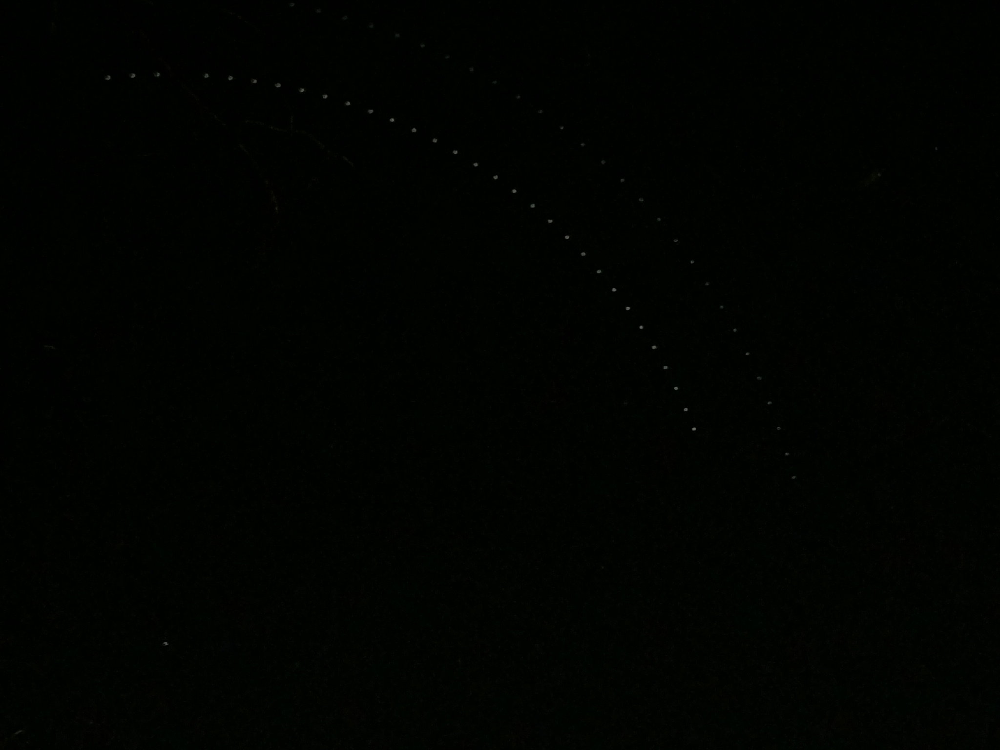

# Calculating Pi with a Raspberry Pi and Python for Pi Day 2020

3.14.2020

I hereby declare, on this Pi Day, March 14, 2020, the value of Pi to be:  
``3.12184335913949``

## Method
Draw a segment of a circle using the circular path that stars follow in the night sky and calculate pi from the drawn circle's circumference and radius.
### Steps
* Photograph the double star, Kochab, between 12:00 AM 05:10 AM on 3/14/2020 as it follows a circular path in the sky and stitch the pictures together.
* Measure the distance between each location of Kochab throughout the night. Take the sum of these distances to find the length of the segment of the circle Kochab traces in the sky. Extrapolate the circumference of entire circle.
* Find the center of the circle and the radius:
  1. Method 1:
      * Calculate the number of degrees of the circle, the segment takes up.  
      ``Time Span of Photos / Length of Sideral Day * 360``
      * Draw a line connecting the first and last location of Kochab.
      * Draw another line perpendicular to the previous line, starting at the midpoint of the previous line continuing towards the center of the circle.
      * Draw a third line that connects either endpoint of the first line and the second line such that it meets the second line at an angle equivalent to half calculated angle in the first step.
      * The third line meets the second line at the centerpoint of the circle and its length is the radius of the circle.
  2. Method 2:
      * Draw a line connecting the first and last locations of Kochab.
      * Draw a line connecting the first and middle location of Kochab.
      * Draw a line connecting the middle and last location of Kochab.
      * Draw 3 lines, 1 each perpendicular to the 3 previous lines starting at the midpoint of previous lines continuing towards the center of the circle.
      * Where these 3 lines intersect is the center of the circle.
      * Draw a line from the center of the circle to any of the locations of Kochab. The length of this line is the radius.
  3. Method 3:
      * Draw a line from any location of Kochab to the North Star, Polaris. The length of this line is the radius.
* Calculate Pi using the formula for the circumference of a circle.  
``C = 2πR``  
``π = C/R/2``

## Preparation
#### Taking pictures at fixed intervals with a remote trigger.
To complete this project pictures need to be taken at fixed intervals. The camera must also be held in a fixed position for the duration of the picture taking. Any small movements of the camera, such as touching it to take a photo, will decrease the accuracy of the resulting circle.  
Because I don't have a camera that has remote trigger capabilities, I used my cellphone, a 1st generation Google Pixel, to take the pictures. Besides pressing the button on the touch screen to take a picture, on Android devices, pressing the volume up button while the camera is open will also trigger the picture to be taken. This means any set of headphones with play/pause/volume control buttons on them can be used as a remote trigger. Though this solves the problem of not having to touch the phone (and potentially move it) to take pictures, it would still require pressing the volume up button manually every 10 minutes for the duration of the photo capturing event. No thank you! This is where the Raspberry Pi comes in to save the day.  
Using the Raspberry Pi, I could build a circuit for a volume up button that plugs in to into the headphone jack, replacing the button with a transistor that can be triggered programatically by the Raspberry Pi GPIO pins.
#### Building the Remote Trigger Circuit
  
<sub>Circuit and resistor values based on [Android 3.5 mm Headset: Accessory Specification](https://source.android.com/devices/accessories/headset/plug-headset-spec)</sub>  

  
#### Triggering Circuit on the Raspberry Pi
[autoTrigger.py](autoTrigger.py)
```
import RPi.GPIO as GPIO
from datetime import datetime
from time import sleep

triggerPin = 37

GPIO.setmode(GPIO.BOARD)
GPIO.setup(triggerPin, GPIO.OUT)
capturedTime = -1


def capture():
	GPIO.output(triggerPin, GPIO.HIGH)
	# hold button on for 50 ms
	sleep(.05)
	GPIO.output(triggerPin, GPIO.LOW)

try:
	while True:
		now = datetime.now()
		if now.minute % 10 == 0 and now.minute != capturedTime:
			capture()
			capturedTime = now.minute
			print("Photo Captured: " + now.strftime("%H:%M:%S"))
finally:
	GPIO.cleanup()
```

#### The Setup


## Execution
#### Running the Script on the Raspberry Pi
At 12:00 AM 3/14/2020 I set the script running on the Raspberry Pi. After about an hour of watching, I set off to bed, hoping no wind, animals, malicous humans, nor eight story tall crustaceans from the paleolithic era would disturb my set up. At 05:00 AM I awoke, pleased to find everything undisturbed, Raspberry Pi dutifully chugging along.

<sup>Note: The Raspberry Pi's system clock was ahead by approximately 4 hours. Photo's taken from 12:00 AM to 05:10 AM.<.sup>
#### The Composite Photo

**Bottom Left:** The North Star, Polaris  
**Primary (brighter) Arc:** Kochab (double star)  
**Secondary (dimmer) Arc:** Pherkad (pulsating double star)  

<sup>Note: The gap in Kochab's arc near the top is due to a tree branch blocking it. Doh!</sub>
#### Taking Measurements
The composite photo was brought into Fusion 360 to sketch the line segments over the photo and take measurements.
  
##### Circumference
``2428.66925967616``  
The total length of the arc as measured in Fusion 360: ``522.917 units``  
<sup>Note: the units in this case are mm as a result of using Fusion 360, though they could have been measured in pixels or any other unit. The specific unit used does not matter.</sup>  
The arc in the composite represents 5 hours, 9 minutes, 12 seconds (``18,552`` seconds in total). A sidereal day on Earth is 23 hours, 56 minutes, 4.098903691 seconds (``86,164.098903691`` seconds in total). From this we can extrapolate the circumference.  
``18,552 / 86,164.098903691 = 0.215310091284198``  
``522.917 / 0.2153100912841980 = 2428.66925967616 units``

##### Radius
Method 1: ``388.98``  
Method 2: ``405.955``  
Method 3: ``403.551``

##### Calculating Pi
|||Value of Pi|Accuracy|
|:--|:--|:--|:--|
|Method 1|2428.67 / 388.98 / 2 =|3.12184335913949|99.37%|
|Method 2|2428.67 / 405.955 / 2 =|2.99130354309734|95.22%|
|Method 3|2428.67 / 403.551 / 2 =|3.00912308441332|95.78%|

# <p align="center">Happy Pi Day!</p>
